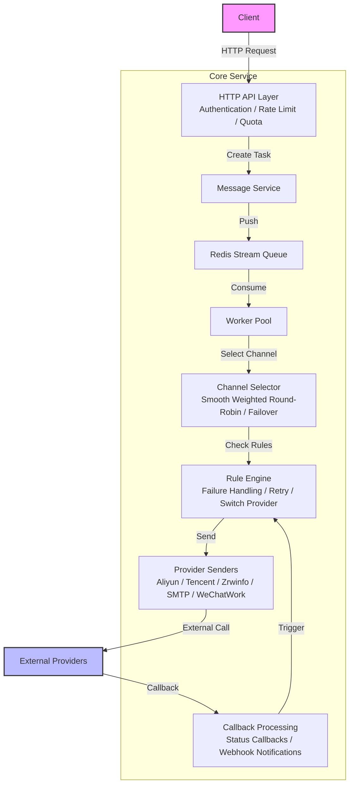
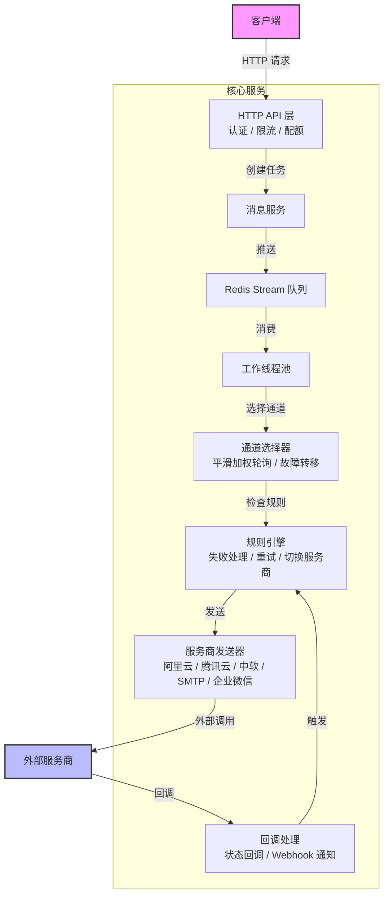

# Architecture Diagram

```mermaid
graph TD
    Client[Client] -->|HTTP Request| API[HTTP API Layer<br/>Authentication / Rate Limit / Quota]
    API -->|Create Task| Service[Message Service]
    Service -->|Push| Queue[Redis Stream Queue]
    Queue -->|Consume| Worker[Worker Pool]
    Worker -->|Select Channel| Selector[Channel Selector<br/>Smooth Weighted Round-Robin / Failover]
    Selector -->|Check Rules| RuleEngine[Rule Engine<br/>Failure Handling / Retry / Switch Provider]
    RuleEngine -->|Send| Senders[Provider Senders<br/>Aliyun / Tencent / Zrwinfo / SMTP / WeChatWork]
    Senders -->|External Call| Providers[External Providers]
    
    Providers -->|Callback| Callback[Callback Processing<br/>Status Callbacks / Webhook Notifications]
    Callback -->|Trigger| RuleEngine
    
    subgraph "Core Service"
        API
        Service
        Queue
        Worker
        Selector
        RuleEngine
        Senders
        Callback
    end
    
    style Client fill:#f9f,stroke:#333,stroke-width:2px
    style Providers fill:#bbf,stroke:#333,stroke-width:2px
```

```mermaid
graph TD
    Client[客户端] -->|HTTP 请求| API[HTTP API 层<br/>认证 / 限流 / 配额]
    API -->|创建任务| Service[消息服务]
    Service -->|推送| Queue[Redis Stream 队列]
    Queue -->|消费| Worker[工作线程池]
    Worker -->|选择通道| Selector[通道选择器<br/>平滑加权轮询 / 故障转移]
    Selector -->|检查规则| RuleEngine[规则引擎<br/>失败处理 / 重试 / 切换服务商]
    RuleEngine -->|发送| Senders[服务商发送器<br/>阿里云 / 腾讯云 / 中软 / SMTP / 企业微信]
    Senders -->|外部调用| Providers[外部服务商]
    
    Providers -->|回调| Callback[回调处理<br/>状态回调 / Webhook 通知]
    Callback -->|触发| RuleEngine
    
    subgraph "核心服务"
        API
        Service
        Queue
        Worker
        Selector
        RuleEngine
        Senders
        Callback
    end
    
    style Client fill:#f9f,stroke:#333,stroke-width:2px
    style Providers fill:#bbf,stroke:#333,stroke-width:2px
```
