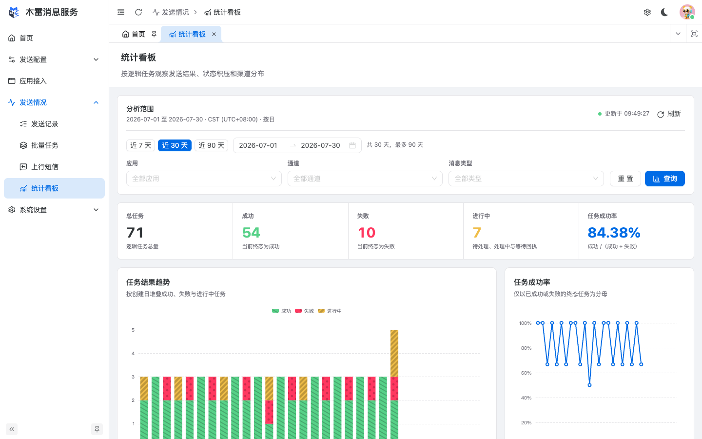

# 项目介绍

木雷消息服务（Mulei Message Service）是面向业务系统的统一消息投递平台。它把短信、邮件、企业微信和钉钉等发送能力收敛为一致的 API 与管理后台，让业务应用不必分别处理供应商 SDK、模板差异、失败重试、主备切换和回执追踪。

业务系统只需要关心三件事：使用哪个应用身份、选择哪个发送通道、传入哪些模板变量。消息进入平台后，模板渲染、异步排队、供应商选择、失败处理和发送留痕都由平台完成。

## 适用场景

- 登录验证码、身份验证和安全提醒。
- 订单状态、交易结果、预约进度等业务通知。
- 服务异常、值班告警和运维通知。
- 营销活动、会员触达和批量消息。
- 需要定时发送、供应商主备或统一审计的内部消息平台。

如果系统只有一个固定供应商、没有异步处理和可观测性要求，直接调用供应商接口可能更简单；当多个业务应用需要共用发送资源，或需要稳定性、审计和统一治理时，木雷消息服务更合适。

## 一条消息如何完成投递

1. 业务应用使用 App ID 与 App Secret 对请求进行 HMAC-SHA256 签名。
2. 平台校验时间戳、随机数、签名、配额、限流和通道就绪状态。
3. 系统模板渲染业务内容，任务先写入数据库，再进入 Redis Stream 或定时集合。
4. Worker 按通道优先级和组内权重选择可用的供应商资源。
5. 发送失败时，失败策略可以执行重试、切换供应商、标记失败或告警。
6. 发送结果、供应商请求与响应、回执、Webhook 和上行短信统一留痕。

这套流程同时适用于单条、批量和定时消息。业务应用通过任务 ID 查询状态，并应按幂等方式处理重复或乱序回调。

## 管理后台一览

### 从配置资源到一次可靠发送

发送准备台把系统模板、服务商账号、供应商模板、供应商签名、发送通道和真实测试串成一条配置路径，并直接显示缺失项与发送就绪状态。

*发送准备台用于判断系统是否已经具备生产发送条件，并给出下一步操作入口。*

### 用发送通道编排主备资源

发送通道是业务调用的稳定入口。一个通道可以绑定多个供应商资源，通过优先级负责主备切换，通过同优先级内的权重分配流量；列表会区分就绪、降级和阻塞状态。

*通道列表集中展示消息类型、系统模板、发送就绪状态和管理状态。*

### 从任务追踪到供应商日志

每次投递都会形成任务记录。管理员可以查看消息内容、模板参数、重试次数、供应商请求与响应、回执和 Webhook 日志，用同一个任务 ID 串起完整链路。

*任务详情用于定位模板、通道、供应商和回调环节的问题。演示数据不会调用真实服务。*

### 观察发送趋势和成功率

统计看板按时间、应用、通道和消息类型汇总任务量、状态构成与终态成功率，并提供应用和通道排行，适合观察业务趋势和发现异常波动。

*统计页面使用 SQLite 演示库中的确定性假数据。*

## 核心对象

| 对象 | 作用 |
|---|---|
| 应用 | 隔离调用身份、密钥、配额、限流、IP 白名单和 Webhook。 |
| 系统模板 | 定义业务内容和变量，是调用方稳定使用的内容契约。 |
| 服务商账号 | 保存供应商调用凭证；敏感配置使用现有加密能力存储。 |
| 供应商模板与签名 | 映射供应商平台审核通过的模板代码、变量和短信签名。 |
| 发送通道 | 组合系统模板与一个或多个供应商资源，是 API 发送时选择的入口。 |
| 失败策略 | 根据场景、服务商、消息类型和错误信息执行重试、切换、失败或告警。 |
| 发送任务 | 保存接收者、内容、状态、重试、日志、回执与回调结果。 |

## 能力范围

| 能力 | 说明 |
|---|---|
| 消息类型 | 短信、邮件、企业微信和钉钉。 |
| 服务商 | 阿里云短信、腾讯云短信、掌榕网、网易云信和 SMTP 等。 |
| 投递方式 | 单条、批量与定时发送。 |
| 异步架构 | 数据库持久化、Redis Streams、Worker Pool 和定时任务扫描。 |
| 高可用 | 优先级、平滑加权轮询、熔断状态、自动停用、失败重试与供应商切换。 |
| 安全 | HMAC-SHA256、时间戳、随机数、防重放、应用配额、限流和 OIDC 管理员登录。 |
| 可观测性 | 健康检查、结构化日志、发送记录、回执、Webhook 日志、上行短信和统计分析。 |

## 可靠性与安全边界

- 队列采用 at-least-once 语义；调用方应保存任务 ID，并对查询与回调做幂等处理。
- 通道的“已启用”不等于“可发送”，还必须满足模板、绑定、账号、签名和资源激活等静态就绪条件。
- 供应商切换只能在已经配置且可用的绑定之间进行，不能替代供应商侧的审核与额度管理。
- 应用密钥只在创建或重新生成时完整展示；生产环境必须使用独立的 JWT、数据库、Redis、OIDC 和加密配置。
- 本手册中的域名、手机号、凭证、请求响应和统计数据均为演示值，不会调用真实短信、邮件或机器人服务。

## 开始使用

1. 本机快速体验：运行[本地 SQLite 演示](02-quick-start/sqlite-demo.md)，使用确定性假数据浏览全部后台页面。
2. 正式部署：通过[Web 安装向导](02-quick-start/web-install.md)连接 MySQL 或 PostgreSQL，并配置独立 Redis。
3. 准备发送资源：按[发送准备台](02-quick-start/onboarding.md)依次完成模板、服务商资源、通道和验证。
4. 创建调用身份：在[应用接入](03-admin/applications.md)中创建应用并安全保存密钥。
5. 接入 API：阅读[请求认证与签名](04-api/authentication.md)，再选择单条、批量或定时发送接口。

进一步了解内部组件和一致性边界，请阅读[架构设计](06-architecture.md)；生产上线前请完成[部署运维](05-operations/README.md)中的安全与故障排查检查。

## 版本说明

本文档对应 M-Doc `v1.0.0` 和 Go 1.25+ 项目代码。SQLite 只用于本地界面演示、自动验证和文档截图，不在正式 Web 安装向导中开放；正式运行使用 MySQL 或 PostgreSQL。
